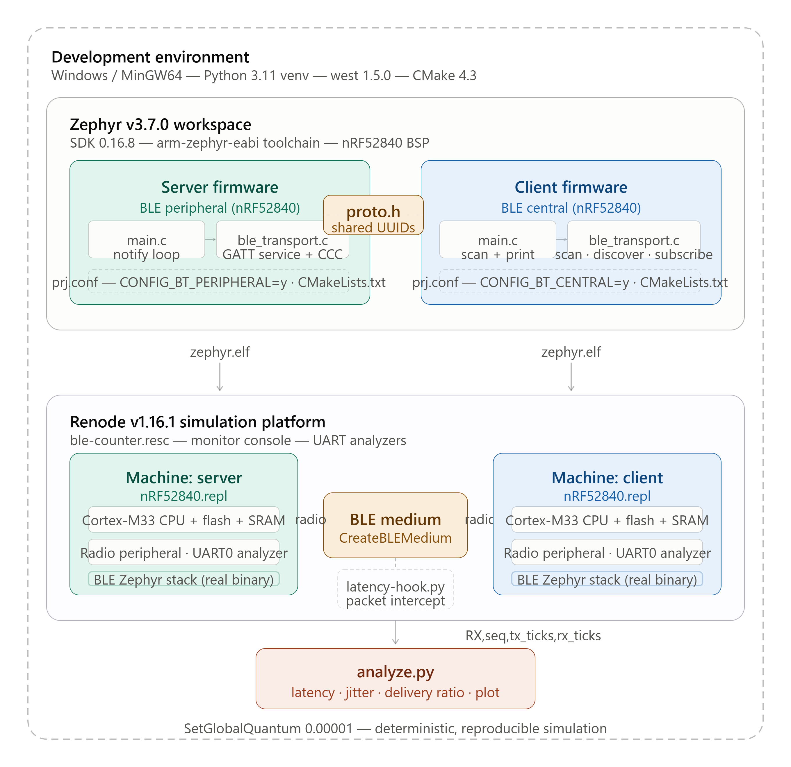

# Learning Goals:
   1. Introductory Information over Wireless Technology like Bluetooth
   2. Getting familiar with Renode
   3. Comparison of wired and wireless communication technology (SOME/IP vs. Bluetooth)

# BLE Counter — A Minimal Renode Starter

The smallest BLE project that's still real: a **server** that notifies an
incrementing counter once a second, and a **client** that finds it, subscribes,
and prints each value. Two simulated nRF52840 nodes in Renode. No audio, no
threads, no benchmarking — just the BLE essentials so the concepts don't
overwhelm you.

## The 6 BLE ideas, in one breath

You only need these to understand everything here:

1. **Server (peripheral)** advertises and holds data. **Client (central)** scans
   and connects. (Like the DroneBot tutorial's two ESP32s — server + client.)
2. **Service** = a labelled group of data ("the mailbox"). Has a **UUID**.
3. **Characteristic** = one piece of data inside a service ("the slot you read").
   Also has a UUID. Ours is the counter.
4. **Notify** = the server pushes a new value to the client whenever it changes,
   instead of the client polling. Great for sensor-like data.
5. **CCC descriptor** = the on/off switch for notifications. The client writes it
   to say "yes, send me updates." (`BT_GATT_CCC` in the server code.)
6. **Discovery** = after connecting, the client walks the server's table to find
   the characteristic + its CCC, *then* subscribes.

That's it. The server code is points 2–5; the client code is points 1 + 6.

## What you'll see when it runs

```
server: advertising as 'ble_counter'
client: scanning for 'ble_counter'
client: found 'ble_counter', connecting...
server: connected
client: connected, discovering...
client: subscribed!
server: notifications ENABLED
server: notified counter = 1
client: RECEIVED counter = 1
server: notified counter = 2
client: RECEIVED counter = 2
...
```

When the client's `RECEIVED counter` keeps pace with the server's `notified
counter`, you've got a working BLE link in simulation. That's the milestone.

## Files (there are only a few — read them in this order)

1. `proto.h` — the shared UUIDs. The one thing both sides must agree on.
2. `server/src/main.c` — define service, advertise, notify a counter. ~85 lines.
3. `client/src/main.c` — scan, connect, discover, subscribe, print. ~140 lines,
   but mostly the discovery walk, which is commented step by step.
4. `renode/ble-counter.resc` — wire two nodes to one BLE medium.

## Development Environment



## Build & run

Prereqs: a Zephyr workspace + SDK, and Renode (binary release). If you've never
set those up, refer to `renode-getting-started.md`) — that confirms your install before you
add your own code.

```bash
# one-time Zephyr setup (in this folder)
west init -l . && west update && west zephyr-export
export ZEPHYR_BASE=$PWD/zephyr

# build both nodes for the nRF52840 (the board Renode models well)
west build -p auto -b nrf52840dk/nrf52840 server -d build/server
west build -p auto -b nrf52840dk/nrf52840 client -d build/client

# run
renode renode/ble-counter.resc
# in the Renode monitor:
(monitor) start
```

## Likely first-run snags (all normal)
- **Client never connects** — usually the Renode quantum; keep
  `SetGlobalQuantum "0.00001"`. Or the advertised name didn't match `proto.h`.
- **Subscribed but no values** — the server only notifies once the CCC is
  enabled; check the client actually reached "subscribed!".
- **Discovery stops early** — the staged discovery handle ranges in
  `discover_cb` are the usual suspect. It's the fiddliest 20 lines here; if you
  debug it, you genuinely understand GATT.
- **Zephyr version drift** — board name / a few Kconfig symbols shift between
  versions; v3.7.0 is the assumed baseline.
- Zephyr ecosystem is not yet compatible with the newer versions of python , make sure to 
  use older versions 
- SDK was missing and installation took some time
- To avoid missing packages while building binaries of Zephyr project, try to run the following:
py -3.11 -m pip install -r /pathtoZephyr/zephyr/scripts/requirements.txt  
- Renode’s built‑in terminal cannot change keyboard layout. It is currently hard‑coded to behave like en_US, and this is a known, unresolved issue ( might change in coming years ). 