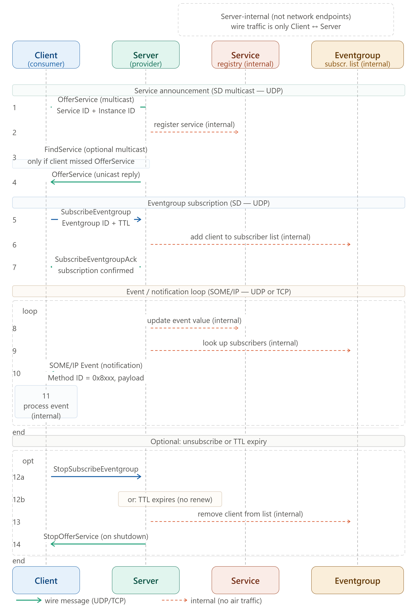
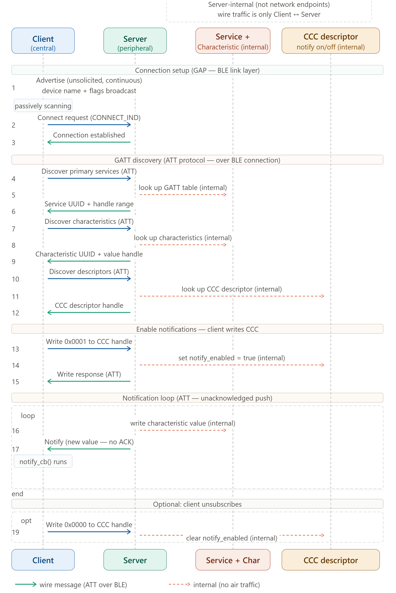

1. **The Strongest parallel**
   The subscribe/notify spine. This is the sentence to say out loud: "The BLE CCC-write-then-notify pattern and the SOME/IP SubscribeEventgroup-then-Event pattern are the same publish-subscribe idea at different protocol layers." In both: the consumer explicitly opts in to a data stream by writing a single descriptor/field on the provider, the provider stores that subscriber internally, and then pushes updates to all subscribers whenever data changes without the consumer having to poll. The Eventgroup subscriber list (steps 6, 9, 13) maps exactly to the CCC descriptor (steps 10, 15, 18 in your Eraser diagram). Both are the server-side on/off switch that the client writes remotely.

2. **The biggest structural difference**
   Service discovery is network-level in SOME/IP. In BLE, service discovery happens over the ATT protocol after a connection is established — it is connection-scoped and point-to-point. In SOME/IP, service discovery (SD) happens over UDP multicast before any connection. The OfferService message goes to a multicast group address and every node on the Ethernet segment can hear it simultaneously. FindService is similarly broadcast. This is why SOME/IP-SD can support many consumers discovering the same service without each needing an individual connection to the provider first — it scales to the multi-ECU vehicle network. BLE's GATT discovery is fundamentally one client, one server, one connection.

3. **The TTL mechanism has no BLE equivalent**
   SOME/IP subscriptions carry a time-to-live value (step 5). The client must periodically renew its SubscribeEventgroup before TTL expires or it gets silently removed from the subscriber list (step 12b). BLE has no equivalent — a BLE subscription persists until the CCC is explicitly written to zero or the connection drops. This TTL mechanism in SOME/IP handles node failure gracefully in a network where ECUs can crash and restart — if a consumer ECU reboots and stops renewing, the provider eventually stops sending it events without needing an explicit disconnect.

4. **Transport under the messages**
    Your BLE diagram's wire arrows are ATT protocol over a BLE connection (L2CAP). The SOME/IP wire arrows here are UDP (for SD and events) or TCP (for reliable method calls) over IP over Automotive Ethernet (100BASE-T1). The application semantics are similar; the transport stack underneath is completely different. This is the OSI layer comparison we built earlier, made concrete.

5. **The internal structures**
   Both diagrams show internal server state that the client never directly addresses. In BLE: Service/Characteristic/CCC. In SOME/IP: the service registry and eventgroup subscriber list. The parallel I drew is that Service Registry ≈ GATT service table, and Eventgroup subscriber list ≈ CCC value. The key difference: in SOME/IP the registry is queried before connection and serves many clients simultaneously via multicast; in BLE the service table is queried per-connection and is only visible after connect.