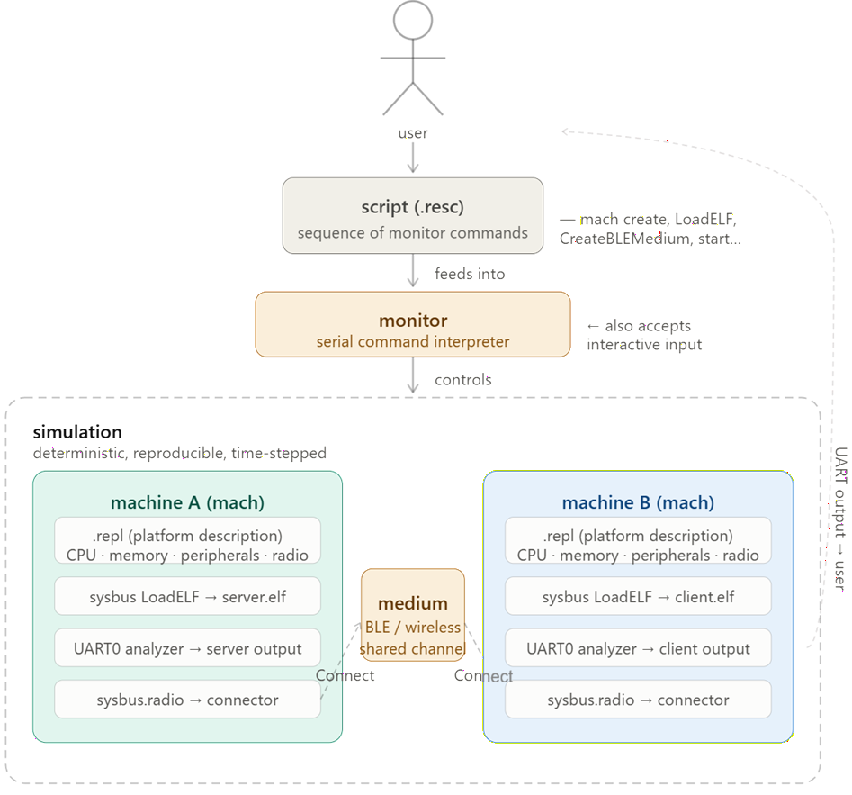

# Renode Getting-Started Guide (via the stock BLE example)

Goal: Getting familiar with Renode by running its **shipped** two-node BLE demo.

> Why start with the stock demo: it uses **precompiled binaries hosted by Antmicro**,
> so you need tools like Zephyr to see two simulated nRF52840 nodes talk over BLE **without any 
> hardware**. If this works, you get a sense of how Renode works.

---

# Renode Mental Model



## Step 1 — Install Renode

Grab a binary release (don't build from source for a first run):
- Linux: download the `.deb`/`.tar.gz` from https://github.com/renode/renode/releases
- macOS / Windows: portable packages on the same page; Windows users can also use WSL2

Verify:
```bash
renode --version
```
If you prefer no local install, Antmicro also offers a browser-based version, but local
is better for learning because you keep the logs and files.

---

## Step 2 — Understand the 4 concepts before you run anything

Renode has a small vocabulary. Learn these and the rest follows:

1. **Machine (`mach`)** — one simulated device (CPU + memory + peripherals). The BLE
   demo has two: a "central" and a "peripheral."
2. **Platform description (`.repl`)** — a text file describing *what* a machine is
   (which CPU, which peripherals at which addresses). `platforms/cpus/nrf52840.repl`.
3. **Script (`.resc`)** — Renode commands run in sequence: create machines, load
   binaries, wire them together, start. Think of it as the "scene setup."
4. **Medium** — for wireless, a shared channel (`CreateBLEMedium`) that machines'
   radios connect to. This is the simulated air.

The interactive prompt is called the **Monitor**. You type commands there, or feed it
a `.resc`.

---

## Step 3 — Run the shipped BLE demo

Renode ships a ready-to-run two-node BLE script. From the Monitor:

```
(monitor) include @scripts/multi-node/nrf52840-ble-zephyr.resc
(monitor) start
```

What this does, line by line (open the .resc in a text editor and read along — this is
the best 10 minutes you'll spend):
- `emulation CreateBLEMedium "wireless"` — makes the shared radio channel
- `mach create "central"` + `LoadPlatformDescription @platforms/cpus/nrf52840.repl` —
  builds the first node from its platform description
- `connector Connect sysbus.radio wireless` — plugs that node's radio into the medium
- `showAnalyzer uart0` — opens a window showing the node's serial output
- (repeats for the "peripheral" node)
- `emulation SetGlobalQuantum "0.00001"` — the time-sync granularity between the two
  simulated CPUs; BLE needs it tight or the stacks drift
- the `reset` macro loads the precompiled heart-rate ELF binaries into each node

**Expected result:** two UART analyzer windows pop up, you type `start`, and you see
the central discover the peripheral and heart-rate notifications flowing between them.

---

## Step 4 — Poke it (this is where understanding happens)

Once it runs, experiment from the Monitor — these map 1:1 onto things you'll claim in
the interview:

```
# Pause / resume the whole emulation deterministically
(monitor) pause
(monitor) start

# Inspect a machine
(monitor) mach set "central"
(monitor) peripherals                 # list this machine's peripherals
(monitor) sysbus                      # see the memory map

# Watch the wireless traffic in Wireshark (great demo moment)
(monitor) emulation LogWirelessTraffic

Things worth trying, and what they teach:
- **Pause/resume/step** → Renode is *deterministic*: same run, same result. This is the
  whole reason simulation beats hardware for benchmarking.
- **`LogWirelessTraffic` + Wireshark** → you can inspect real protocol packets. Shows
  the binaries run a genuine BLE stack, not a mock.
```

## Troubleshooting first-run issues

| Symptom | Likely cause / fix |
|---|---|
| `include` can't find the script | Run from Renode's install dir, or use the full path to the `.resc` |
| Nodes never connect | Quantum too coarse — keep `SetGlobalQuantum "0.00001"`; for your own build, MTU/buffer mismatch in prj.conf |